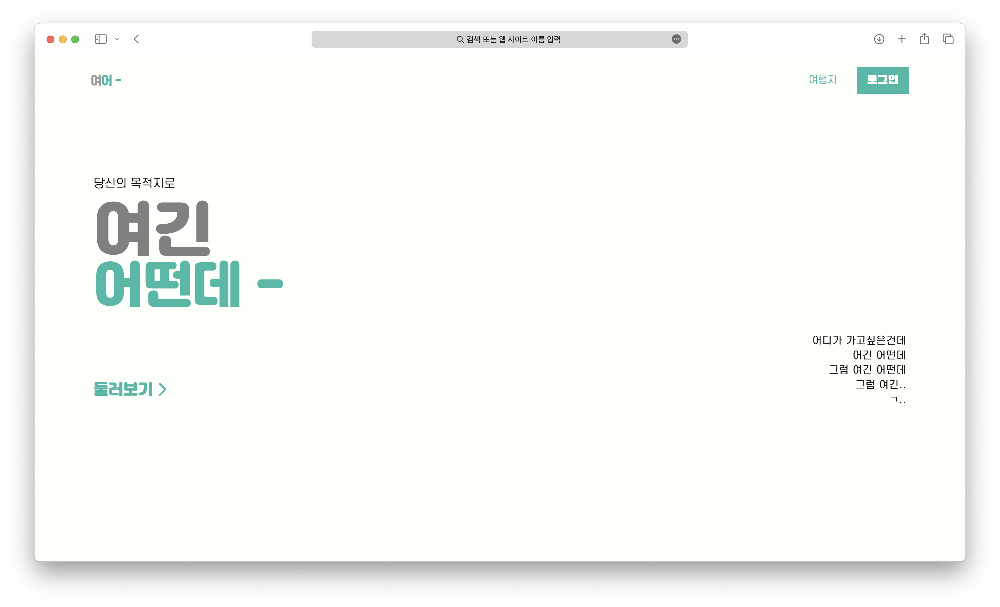
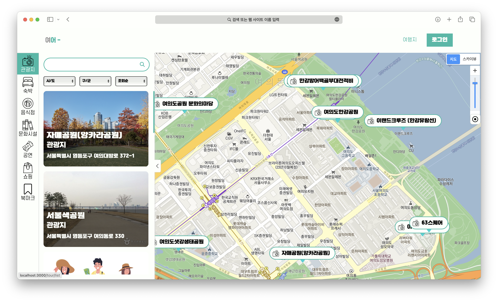
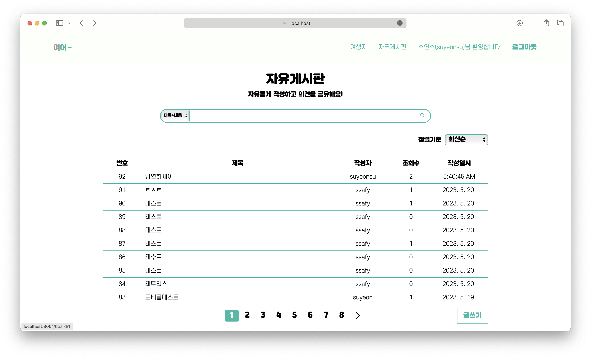
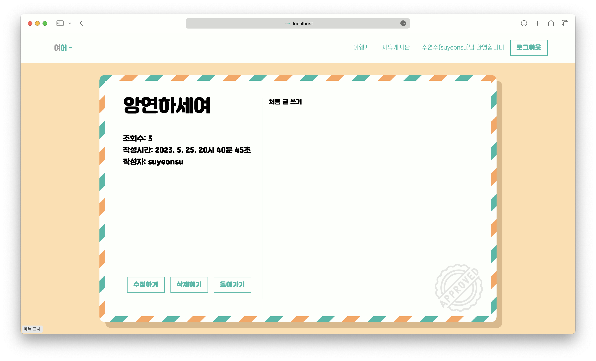
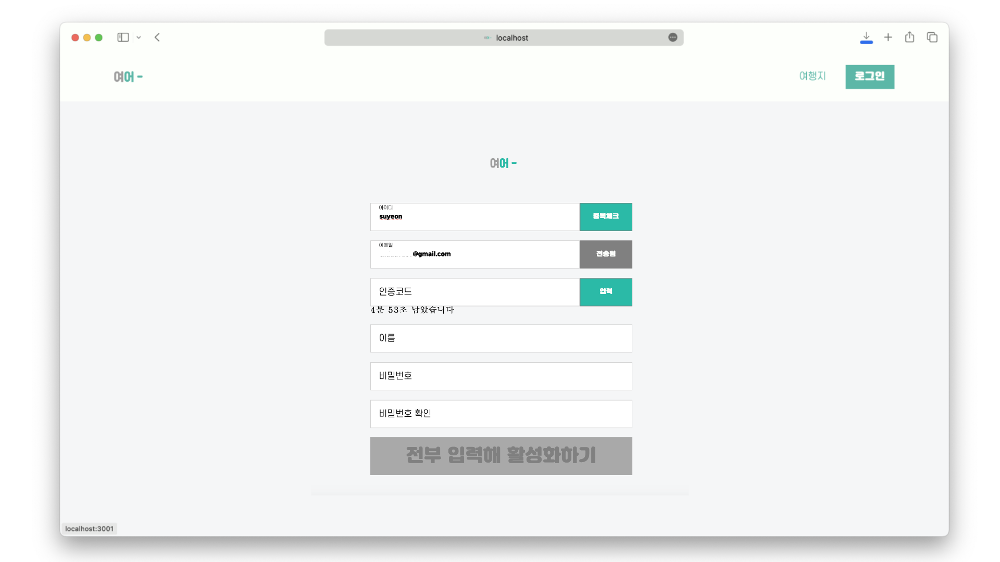
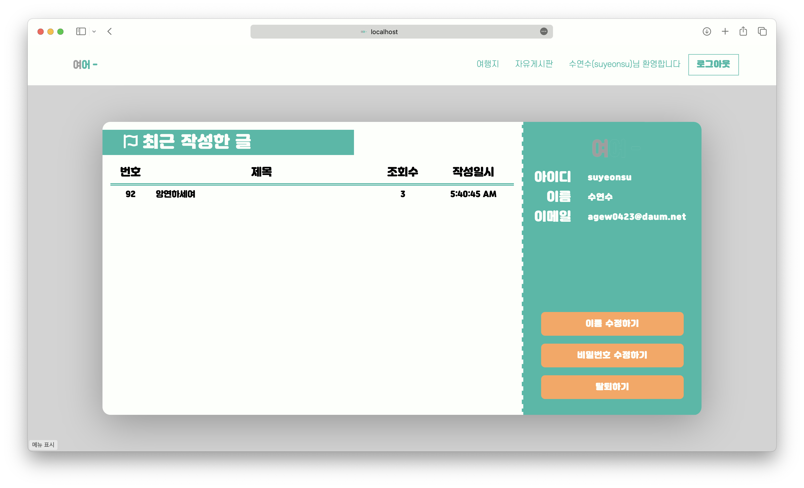

### 당신의 목적지로
# 여긴 어떤데 -

# 여긴 어떤데 -
> **삼성 청년 SW 아카데미 1학기 최종 프로젝트**   **개발기간: 2023.03 ~ 2023.05**

 

## 프로젝트 소개 💬

**여긴 어떤데**는 지도를 통해 테마 별 관광지 정보를 제공하는 웹사이트입니다. 코로나19가 감소세에 접어들고 방역 지침 해제됨에 따라 국내 여행/관광 산업이 다시 관심을 받고 있습니다. **여긴 어떤데**는 이러한 트렌드에 발맞춰 사용자에게 관광 명소, 음식점, 문화 시설 등의 정보를 제공하기 위해 제작되었습니다. 사용자들은 자유게시판을 통해 의견을 공유하거나 관광지를 북마크하여 목록을 관리할 수 있습니다. 국내 관광지 정보 공공데이터를 활용해 개발한 프로젝트입니다.

 

## 팀원 소개 🪪

|      김수연       |          노호종         |                                                                       
| :------------------------------------------------------------------------------: | :---------------------------------------------------------------------------------------------------------------------------------------------------: |
|       |                          |
|   [@suyeonsu](https://github.com/suyeonsu)   |    [@Probe001](https://github.com/Probe001)  |
| Backend | Frontend |

 

## Stacks 📦

### Environment

          

### Backend

### Frontend

### Communication Tools
 

 

## 화면 구성 📺

| 메인 화면  |  관광지 지도   |  
| :-------------------------------------------: | :------------: |
|   |  |  
| 자유게시판   |  게시글 상세 조회   |  
|    |       |  
| 회원 가입 페이지   |  회원 페이지   |  
|    |       |

 

## 주요 기능 🔦

### 관광지 검색 기능
- 사용자 입력 검색어를 공백 기준으로 파싱하여 유사한 관광지를 검색함
- 거리순, 평점순, 조회수순으로 관광지를 정렬할 수 있음

### 북마크 등록 기능
- 사용자가 관광지를 북마크에 등록/삭제할 수 있는 기능
- 북마크 탭을 통해 사용자는 북마크 목록을 관리할 수 있음

### 평점 등록 기능
- 사용자가 관광지에 평점을 등록/수정할 수 있는 기능
- 관광지의 평점은 사용자들이 부여한 점수를 집계해 총 평점을 표시함